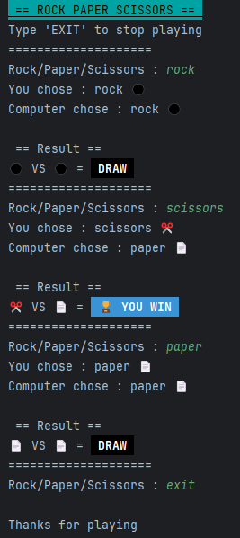

# 🎮 CLI Rock-Paper-Scissors

A simple, interactive Rock-Paper-Scissors game built with Python. This project demonstrates core programming concepts, including dictionary data structures, input validation, and the use of ANSI escape codes to enhance the terminal user experience.

---

## 📌 Features

- **Interactive Gameplay:** Play against a computer opponent real-time.
- **Visual:** Uses emojis and ANSI terminal color schemes for a vibrant interface
- **Validation:** Handles invalid inputs gracefully to prevent program *crashes*.
- **Infinite Loop:** Play as many rounds as you want until you type 'EXIT.

---

## 🛠️ Teknology Stack 

- **Language:** Python 3.14
- **Interface:** Command Line Interface (CLI)
- **Modul:** `random` (built-in Python module for AI move generation).
- **Styling:** ANSI color codes for stylized terminal output

---

## ▶️ How to Run

1. Ensure Python is installed on your system

2. Clone repository:

   ```bash
   git clone https://github.com/CountryIna/RockPaperScissors.git
   ```

3. Navigate to the project folder:

   ```bash
   cd RockPaperScissors
   ```

4. Run the program:

   ```bash
   python RockPaperScissors.py
   ```

---

## 💻 Output Example

 Here is an example of the program output when run in the terminal:



---

## 📚 Project Objectives

This Rock-Paper-Scissors program was developed to:
* Practice fundamental Python programming concepts.
* Implement control structures (`if-elif-else`).
* Utilize infinite loops (`while`) for continuous gameplay.
* Master the logic for determining win, loss, and draw conditions
* Gain experience handling user input and formatted output in interactive apps.

---

## 🚀 Future Improvements

Beberapa ide pengembangan:
* Adding a persistent score tracking system
* Implementing a Graphical User Interface (GUI) using Tkinter or PyQt

---

## 🤝 Contrubution

Contributions are welcome! Feel free to fork this repository and enhance it as needed.

---

## 👨‍💻 Author

Created by **[Country Ina]**

---
